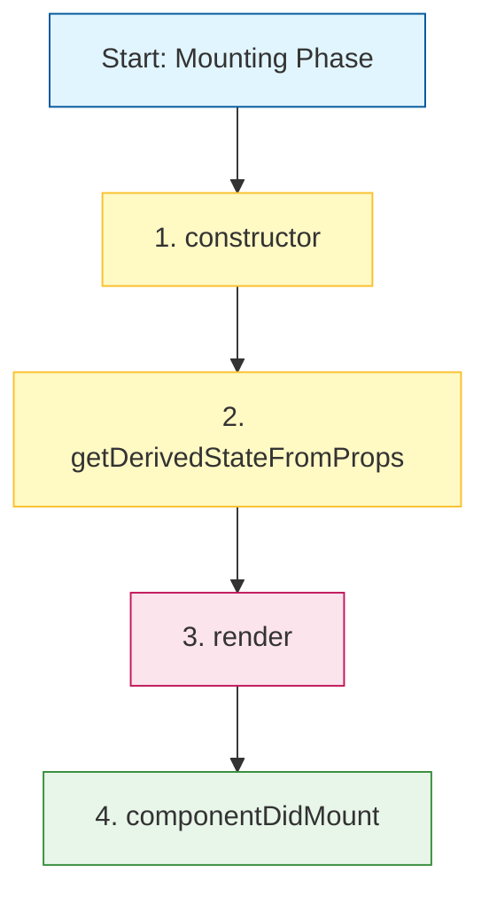
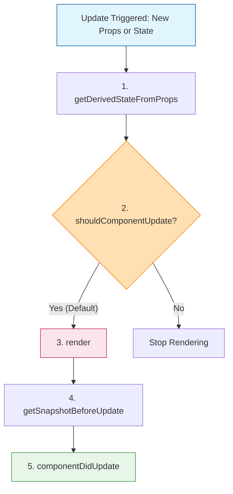

# React Module 4: Class Components

## 1. History and Context

Before React 16.8 (released in 2019), Class components were the only way to track state and lifecycle events in a React component. Function components were considered "state-less" and were primarily used for simple presentational UI.

With the addition of **Hooks**, Function components became almost equivalent to Class components, allowing them to manage state and side effects.

### Status Today
- **Function Components**: The preferred modern standard.
- **Class Components**: Still fully supported. No plans to remove them.

You will likely encounter Class components in older codebases, so understanding them is a valuable skill.

---

## 2. Creating a Class Component

A Class component must:
1. Inherit from `React.Component` using the `extends` keyword.
2. Implement a `render()` method that returns JSX.

### Example: Basic Component
```javascript
import React from 'react';
import { createRoot } from 'react-dom/client';

class Car extends React.Component {
  render() {
    return <h2>Hi, I am a Car!</h2>;
  }
}

// Rendering the component
const container = document.getElementById('root');
const root = createRoot(container);
root.render(<Car />);
```

---

## 3. Constructor & State

The `constructor()` method is called **before** the component is mounted. It is the natural place to initialize the component's state.

**State** is an object where you store property values that belong to the component. When the state object changes, the component re-renders.

**Important**: You must call `super(props)` before any other statement. This executes the parent component's constructor (`React.Component`) and lets you access `this.props`.

### Example: Initializing State in Constructor
```javascript
class Car extends React.Component {
  constructor(props) {
    super(props);
    // Initialize state
    this.state = {
      brand: "Ford",
      model: "Mustang",
      color: "red",
      year: 1964
    };
  }

  render() {
    return (
      <div>
        <h1>My {this.state.brand}</h1>
        <p>
          It is a {this.state.color} {this.state.model} from {this.state.year}.
        </p>
      </div>
    );
  }
}
```

---

## 4. Handling Props

Props ("properties") are passed to the component as attributes. In a class component, you access them via `this.props`.

### Example: Using Props
```javascript
class Car extends React.Component {
  render() {
    // Accessing props via this.props
    return <h2>I am a {this.props.color} Car!</h2>;
  }
}

// Usage
<Car color="blue" />
```

### Props in the Constructor
If your component has a constructor, pass `props` to it and to `super()`.

```javascript
class Car extends React.Component {
  constructor(props) {
    super(props); // Required to access this.props in constructor
  }
  
  render() {
    return <h2>I am a {this.props.model}!</h2>;
  }
}
```

---

## 5. Composition (Components in Components)

You can nest components inside other components, just like function components.

```javascript
class Car extends React.Component {
  render() {
    return <h2>I am a Car!</h2>;
  }
}

class Garage extends React.Component {
  render() {
    return (
      <div>
        <h1>Who lives in my Garage?</h1>
        <Car />
      </div>
    );
  }
}
```

---

## 6. Components in Files

Ideally, each component lives in its own file.

**Step 1**: Create `Vehicle.jsx`
```javascript
import React from 'react';

class Car extends React.Component {
  render() {
    return <h2>Hi, I am a Car!</h2>;
  }
}

export default Car;
```

**Step 2**: Import in `App.jsx`
```javascript
import Car from './Vehicle.jsx';

// Use <Car /> normally
```

---

## 7. Changing State with `setState()`

To change a value in the state object, use the `this.setState()` method. This ensures that the component knows it has been updated and calls `render()` again.

**Example**:
```javascript
class Car extends React.Component {
  constructor(props) {
    super(props);
    this.state = {
      brand: "Ford",
      model: "Mustang",
      color: "red",
      year: 1964
    };
  }

  // Arrow function to bind 'this' automatically
  changeColor = () => {
    this.setState({ color: "blue" });
  }

  render() {
    return (
      <div>
        <h1>My {this.state.brand}</h1>
        <p>
          It is a {this.state.color} {this.state.model} from {this.state.year}.
        </p>
        <button
          type="button"
          onClick={this.changeColor}
        >
          Change color
        </button>
      </div>
    );
  }
}
```

---

## 8. Lifecycle of Components

Each component has a lifecycle: **Mounting** (birth), **Updating** (growth), and **Unmounting** (death).

### Phase 1: Mounting
Called when elements are put into the DOM.



1. **`constructor(props)`**: Initialize state.
2. **`getDerivedStateFromProps(props, state)`**: Rare. Update state based on props before render.
3. **`render()`**: Required. Returns HTML/JSX.
4. **`componentDidMount()`**: Runs *after* render. Place for API calls, timers, subscriptions.

**Example: `getDerivedStateFromProps`**
```javascript
class Header extends React.Component {
  constructor(props) {
    super(props);
    this.state = { favoritecolor: "red" };
  }
  
  // Updates state based on props
  static getDerivedStateFromProps(props, state) {
    return { favoritecolor: props.favcol };
  }
  
  render() {
    return <h1>My Favorite Color is {this.state.favoritecolor}</h1>;
  }
}
```

**Example: `componentDidMount`**
```javascript
class Header extends React.Component {
  constructor(props) {
    super(props);
    this.state = { favoritecolor: "red" };
  }
  
  componentDidMount() {
    // Updates state after 1 second
    setTimeout(() => {
      this.setState({ favoritecolor: "yellow" })
    }, 1000);
  }
  
  render() {
    return <h1>My Favorite Color is {this.state.favoritecolor}</h1>;
  }
}
```

### Phase 2: Updating
Called when state or props change.



1. **`getDerivedStateFromProps(props, state)`**: Called first on update.
2. **`shouldComponentUpdate()`**: Returns Boolean. If `false`, React stops rendering (optimization).
3. **`render()`**: Re-renders HTML.
4. **`getSnapshotBeforeUpdate(prevProps, prevState)`**: Access DOM before update (e.g., scroll position).
5. **`componentDidUpdate()`**: Called after update is finished.

**Example: `shouldComponentUpdate`**
```javascript
class Header extends React.Component {
  shouldComponentUpdate() {
    return false; // Blocks rendering
  }
  
  changeColor = () => {
    this.setState({ favoritecolor: "blue" });
  }
  
  render() {
    return (
      <div>
        <h1>color: {this.state.favoritecolor}</h1>
        <button onClick={this.changeColor}>Change</button>
      </div>
    ); // Button click won't update UI
  }
}
```

**Example: `getSnapshotBeforeUpdate`**
```javascript
class Header extends React.Component {
  getSnapshotBeforeUpdate(prevProps, prevState) {
    document.getElementById("div1").innerHTML =
    "Before the update, the favorite was " + prevState.favoritecolor;
  }
  
  componentDidUpdate() {
    document.getElementById("div2").innerHTML =
    "The updated favorite is " + this.state.favoritecolor;
  }
  // ... rest of component
}
```

### Phase 3: Unmounting
Called when a component is removed from the DOM.

1. **`componentWillUnmount()`**: Cleanup method.

```javascript
class Container extends React.Component {
  constructor(props) {
    super(props);
    this.state = { show: true };
  }
  delHeader = () => {
    this.setState({ show: false });
  }
  render() {
    return (
      <div>
        {this.state.show ? <Child /> : null}
        <button type="button" onClick={this.delHeader}>Delete Header</button>
      </div>
    );
  }
}

class Child extends React.Component {
  componentWillUnmount() {
    alert("The component named Header is about to be unmounted.");
  }
  render() {
    return <h1>Hello World!</h1>;
  }
}
```

---

## 🔴 Quiz: Class Components

**Q1: What method must every Class component inherit from?**
A) `React.Component`
B) `React.Class`
C) `React.Object`

**Q2: Where should you initialize state?**
A) `render()`
B) `componentDidMount()`
C) `constructor()`

**Q3: Which method runs right after the component is rendered to the DOM?**
A) `componentWillMount()`
B) `componentDidMount()`
C) `componentDidUpdate()`

**Q4: If `shouldComponentUpdate` returns `false`, what happens?**
A) The component unmounts
B) The component stops rendering for that update
C) The component throws an error

**Q5: What is the correct way to update state?**
A) `this.state.color = 'red'`
B) `this.setState({ color: 'red' })`
C) `this.updateState({ color: 'red' })`

<details>
<summary><strong>See Answers</strong></summary>

**A1: A.** Class components extend `React.Component`.

**A2: C.** The `constructor` is the natural place to initialize `this.state`.

**A3: B.** `componentDidMount` runs immediately after the component is inserted into the DOM.

**A4: B.** It tells React to skip the render phase for performance optimization.

**A5: B.** Always use `this.setState()` to trigger a re-render.

</details>
